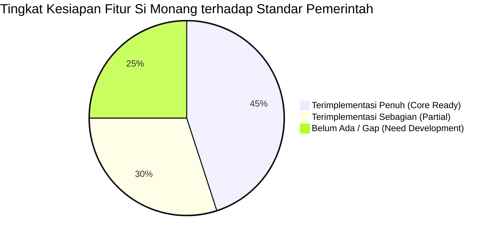
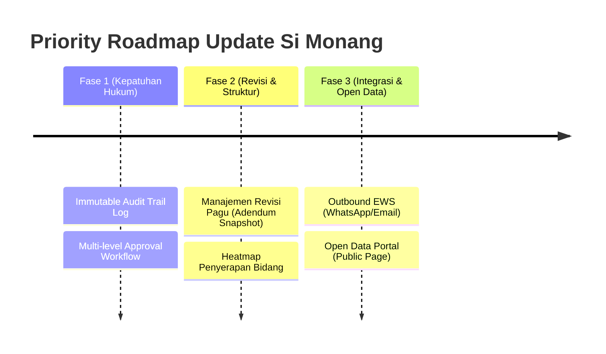

# Analisis Gap: Si Monang vs Standar Aplikasi Monitoring Anggaran Pemerintah

Dokumen ini memuat analisis komprehensif mengenai sejauh mana aplikasi **Si Monang** saat ini telah mengakomodir 5 modul kritikal dalam standar monitoring anggaran sektor pemerintah/BUMN (PT PLN), beserta pemetaan gap (*gap analysis*) dan rekomendasi langkah pengembangannya.

---

## 📊 1. Matriks Evaluasi & Pemetaan Gap (Feature Readiness Score)

| Modul Kebutuhan Pemerintah | Status Saat Ini di Si Monang | Tingkat Kesiapan | Gap Utama |
| :--- | :--- | :--- | :--- |
| **1. Manajemen Pagu & Perencanaan** | PRK + Pagu Locking aktif | 🟠 **60% (Sebagian)** | Belum ada struktur hierarki makro-mikro (Program-Kegiatan-SubKegiatan-KodeRekening) & riwayat revisi anggaran (APBD-P / Adendum snapshot). |
| **2. Pelacakan Realisasi & Penyerapan** | Multi-stage (Draft/Proses/Selesai) + EWS Goroutine Engine | 🟢 **80% (Tinggi)** | Integrasi API langsung dengan E-Procurement (LPSE/LKPP/AMS) dan Notifikasi Outbound EWS (WA/Email) belum terhubung. |
| **3. Analitik & Visualisasi Eksekutif** | S-Curve (Recharts), Donut Chart, & KPI Cards | 🟢 **75% (Tinggi)** | Belum ada Heatmap Penyerapan antar-Bidang/Satker dan S-Curve masih berbasis proyeksi persentase linear (belum Regresi ML). |
| **4. Audit, Kepatuhan & Kontrol** | RBAC Dinamis & Permission Middleware di Go | 🔴 **40% (Rendah)** | Belum ada **Immutable Audit Trail** (log mutasi anggaran) dan **Multi-level Approval Workflow** (PPK -> Verifikator -> PA/Manajer). |
| **5. Transparansi Publik** | Akses terbatas via Login (JWT Auth Only) | 🔴 **10% (Minimal)** | Belum ada Portal Publik (*Open Data Portal*) tanpa login untuk transparansi masyarakat/pemangku kepentingan. |

---

## 🔍 2. Analisis Detail per Modul

### 🔹 Modul 1: Manajemen Pagu & Perencanaan (Perencanaan Anggaran)
*   ✅ **Sudah Terakomodir**:
    *   **Pagu Locking System**: Sangat ketat di backend ([contract.go](file:///Users/wahyubudiman/Documents/prototype/pku_zulfirman/backend/internal/handlers/contract.go)). Sistem secara otomatis menolak transaksi pembuatan/edit kontrak jika akumulasi nilai mengunci sisa pagu PRK.
    *   **Kategori Anggaran**: Membedakan Jenis Anggaran `OPERASI` dan `INVESTASI`.
*   ⚠️ **Gap & Kekurangan**:
    *   **Hierarki Belanja Belum Berjenjang**: Struktur saat ini baru tingkat `PRK -> Pagu -> Kontrak`. Belum memetakan *Program $\rightarrow$ Kegiatan $\rightarrow$ Sub-Kegiatan $\rightarrow$ Kode Rekening Belanja*.
    *   **Manajemen Revisi Anggaran (Snapshot/Adendum)**: Jika ada revisi pagu (contoh: pergeseran anggaran), data lama langsung tertimpa (`UPDATE`), belum ada tabel `pagu_revisions` yang menyimpan snapshot data *sebelum* dan *sesudah* revisi.

---

### 🔹 Modul 2: Pelacakan Realisasi & Penyerapan (Core Monitoring)
*   ✅ **Sudah Terakomodir**:
    *   **Multi-Stage Tracking**: Sudah membagi status transaksi menjadi 3 tahap:
        1.  *Belum Digunakan*: Sisa Pagu Bebas.
        2.  *Dipesan/Dikomitmenkan*: Status `DRAFT` & `PROSES` (Pagu terkunci, belum cair).
        3.  *Realisasi Nyata*: Status `SELESAI` (Dana terbayarkan).
    *   **Early Warning System (EWS Engine)**: Goroutine background scheduler di Go ([ews.go](file:///Users/wahyubudiman/Documents/prototype/pku_zulfirman/backend/internal/handlers/ews.go)) secara otomatis memindai Nota Dinas backlog (>30 hari kerja) & sisa pagu kritis (<10%) dan menampilkan penanda merah berdenyut (*pulsing glow*).
*   ⚠️ **Gap & Kekurangan**:
    *   **Integrasi System Pengadaan**: Input data Nota Dinas (`tgl_nd`, `no_nd`, `user_bidang`) saat ini masih manual, belum terhubung via API Webhook ke LPSE / LKPP / AMS PLN.
    *   **Saluran Alert Outbound**: Peringatan EWS baru tampil di Web UI, belum dikirim via WhatsApp Gateway / Email ke HP penanggung jawab bidang.

---

### 🔹 Modul 3: Analitik & Visualisasi Eksekutif (Dashboard Pimpinan)
*   ✅ **Sudah Terakomodir**:
    *   **Dashboard Target vs Realisasi (S-Curve)**: Menggunakan `Recharts AreaChart` untuk membandingkan target prognosa dengan penyerapan riil bulanan.
    *   **Komposisi Jenis Belanja**: KPI Cards 4 Pilar (Pagu, Terkontrak, Realisasi, Sisa) dan Donut Chart porsi komitmen.
    *   **Ekspor PDF Eksekutif**: Tersedia fitur cetak laporan ramah printer (`@media print`).
*   ⚠️ **Gap & Kekurangan**:
    *   **Heatmap Satker / Bidang**: Belum ada chart/tabel khusus yang memeringkatkan tingkat penyerapan dari Bidang terkritis hingga paling tinggi secara berdampingan.
    *   **Prognosa Cerdas**: S-Curve target saat ini masih memakai kurva persentase rata-rata statis, belum menggunakan *Polynomial Regression ML* dari data historis tahun sebelumnya.

---

## 🔹 Modul 4: Audit, Kepatuhan, & Kontrol Internal (Audit Trail)
*   ✅ **Sudah Terakomodir**:
    *   **Dynamic RBAC (Role-Based Access Control)**: Pengamanan rute berbasis tabel `permissions` dan `role_permissions` di database dengan middleware dinamis.
*   ⚠️ **Gap & Kekurangan (Area Paling Kritikal di Government)**:
    *   **Auditable Log (Log Mutasi Immutable)**: Belum ada tabel `audit_logs` untuk mencatat identitas user, IP address, stempel waktu, dan detail perubahan `old_value` vs `new_value` saat nilai pagu/kontrak diubah.
    *   **Multi-level Approval Workflow**: Transaksi kontrak belum melewati *state machine* verifikasi berjenjang (misal: `Draft` $\rightarrow$ `Disetujui PPK` $\rightarrow$ `Diverifikasi Keuangan` $\rightarrow$ `Disetujui PA/Manajer`).

---

## 🔹 Modul 5: Transparansi Publik (Open Data Portal)
*   ✅ **Sudah Terakomodir**:
    *   Fasilitas ekspor data mentah CSV/Excel pada tabel Rekap PRK & Monitoring Kontrak.
*   ⚠️ **Gap & Kekurangan**:
    *   **Portal Tanpa Login**: Seluruh rute API Si Monang saat ini terkunci `AuthMiddleware` (JWT). Belum ada landing page publik `/public/dashboard` tanpa login untuk memenuhi Keterbukaan Informasi Publik (KIP).

---

## 🚀 3. Rekomendasi Prioritas Rencana Aksi (Roadmap Imbangan)

Untuk menaikkan kesiapan Si Monang ke level **Government Grade (Kepatuhan & Akuntabilitas Tinggi)**, berikut rekomendasi prioritas pengembangan selanjutnya:

1.  **Fase 1 (Sangat Mendesak - Compliance & Hukum)**:
    *   Membuat tabel `audit_logs` untuk mencatat seluruh mutasi angka pagu dan perubahan data pengguna.
    *   Menerapkan *Approval Workflow Status* pada pembuatan kontrak baru (`SUBMITTED` $\rightarrow$ `VERIFIED_FINANCE` $\rightarrow$ `APPROVED_MANAGER`).
2.  **Fase 2 (Peningkatan Perencanaan & Analitik)**:
    *   Menambahkan fitur **Snapshot Revisi Anggaran** untuk mencatat riwayat pergeseran pagu APBD-P / Adendum.
    *   Membuat komponen **Heatmap Penyerapan Per Bidang/Satker** pada Dashboard.
3.  **Fase 3 (Integrasi & Transparansi)**:
    *   Menghubungkan EWS dengan WA Gateway (Fonnte/Twilio).
    *   Membuat rute publik `/open-data` tanpa autentikasi untuk visualisasi transparansi publik.
