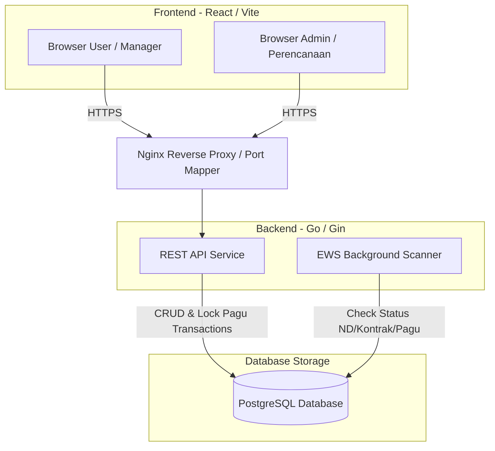

# Spesifikasi Arsitektur & Desain Visual - Si Monang

Dokumen ini menjelaskan struktur arsitektur sistem, aliran proses bisnis cerdas, serta prinsip dan sistem desain visual (UI/UX) yang diimplementasikan pada aplikasi **Si Monang**.

---

## 1. Arsitektur Sistem & Aliran Data

Aplikasi Si Monang dibangun dengan pola modular berbasis monolit terstruktur demi kecepatan pengembangan dan kemudahan deployment:

### Logika Fitur Unggulan di Backend:
1.  **Lock Pagu**: Penambahan/penyuntingan nilai kontrak dijamin oleh database transaction (`tx.Begin()`). Jika nilai total kontrak melebihi sisa pagu PRK, transaksi di-*rollback* secara instan demi mencegah kebocoran anggaran (*zero over-budget*).
2.  **EWS Background Scanner**: Goroutine mandiri berjalan dengan interval waktu konstan di latar belakang untuk mendeteksi kontrak backlog (>30 hari) dan pagu kritis (<10%). Alarm dicatat secara otomatis ke dalam tabel `alerts`.

---

## 2. Desain Antarmuka & Estetika (UI/UX)

Untuk menghadirkan pengalaman pengguna yang premium, modern, dan informatif, arah desain visual Si Monang menggunakan prinsip berikut:

### A. Estetika Glassmorphism & Kedalaman
*   **Efek Frost Glass**: Latar belakang semitransparan dengan filter blur belakang (`backdrop-filter: blur(12px)`) dipadukan dengan border neon tipis ($1\text{px}$) untuk memisahkan kartu KPI dari latar belakang gelap secara premium.
*   **Animasi Mikro**: Kartu KPI dan tombol menu akan sedikit membesar ($1.02\times$) dan memancarkan cahaya glow saat disorot kursor.

### B. Skema Warna HSL
*   **Background Utama**: Deep Dark Blue (`hsl(224, 71%, 4%)` s.d. `hsl(224, 71%, 7%)`) untuk kenyamanan monitoring jangka panjang.
*   **Aksen Utama**: Electric Cyan (`hsl(180, 100%, 50%)`) untuk penanda aman dan prognosis.
*   **Aksen Alarm/EWS**: Amber/Yellow (`hsl(45, 100%, 50%)`) untuk warning ringan dan Crimson Red (`hsl(0, 80%, 50%)`) untuk alarm kritis.

### C. Tipografi & Tata Letak
*   **Font**: Menggunakan **Inter** untuk keterbacaan data numerik anggaran yang optimal.
*   **Grid Layout**: Desain dua kolom yang seimbang di mana Kurva S Prognosa (Area Chart) diletakkan di sisi kiri (lebar) dan Donut Chart Distribusi Anggaran diletakkan di sisi kanan (sempit).
*   **Print Media Stylesheet**: Menyediakan media query print khusus (`@media print`) untuk merender dashboard dalam warna putih bersih, menyembunyikan sidebar navigasi/tombol, dan mengoptimalkan kontras grafik chart saat diekspor ke PDF.
