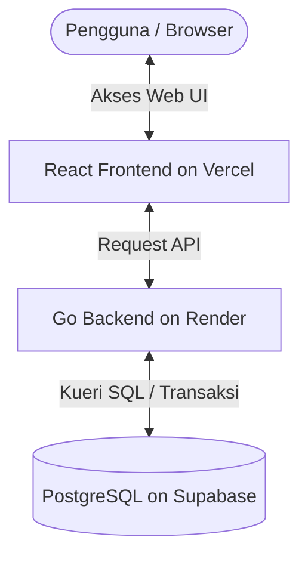

# Panduan Deployment Cloud: Supabase, Render, & Vercel - Si Monang

Dokumen ini menjelaskan langkah demi langkah untuk melakukan *deployment* mandiri aplikasi **Si Monang** ke platform cloud gratis/affordable: **Supabase** (Database PostgreSQL), **Render** (Go Backend), dan **Vercel** (React Frontend).

---

## 💾 Langkah 1: Setup PostgreSQL di Supabase

Supabase menyediakan database PostgreSQL premium dengan kemudahan managed-service.

1.  **Daftar/Login**: Masuk ke [Supabase](https://supabase.com).
2.  **Buat Project Baru**:
    *   Klik **New Project** dan pilih organisasi Anda.
    *   Masukkan Nama Project: `simonang-db`.
    *   Masukkan Password Database (Simpan password ini karena akan digunakan oleh Render).
    *   Pilih Region terdekat (contoh: **Singapore (ap-southeast-1)** untuk kecepatan akses optimal dari Indonesia).
    *   Pilih tier gratis (*Free Tier*) $\rightarrow$ klik **Create new project**.
3.  **Dapatkan Connection Settings**:
    *   Setelah proyek selesai di-provisoning, masuk ke menu **Settings** (ikon gerigi) $\rightarrow$ **Database**.
    *   Cari bagian **Connection parameters**:
        *   **Host**: `aws-0-ap-southeast-1.pooler.supabase.com` (atau sejenisnya)
        *   **Database Name**: `postgres` (default)
        *   **Port**: `5432` atau `6543` (Transaction Pooler lebih direkomendasikan untuk Go serverless/background workers)
        *   **User**: `postgres`

---

## 🚀 Langkah 2: Deploy Go Backend di Render

Render sangat cocok untuk menjalankan aplikasi Go HTTP API secara gratis tanpa perlu mengonfigurasi VM linux manual.

1.  **Daftar/Login**: Masuk ke [Render](https://render.com) menggunakan GitHub/GitLab.
2.  **Buat Web Service Baru**:
    *   Klik **New +** $\rightarrow$ **Web Service**.
    *   Hubungkan repositori Git proyek **pku_zulfirman** Anda.
3.  **Konfigurasi Parameter Web Service**:
    *   **Name**: `simonang-backend`
    *   **Language**: `Go`
    *   **Root Directory**: `backend` (Sangat penting karena kode backend ada di folder sub-direktori `backend`).
    *   **Build Command**: `go build -o main main.go`
    *   **Start Command**: `./main`
4.  **Konfigurasi Environment Variables**:
    Klik bagian **Advanced** $\rightarrow$ **Add Environment Variable**:
    
    | Key | Value / Contoh | Keterangan |
    | :--- | :--- | :--- |
    | `DB_HOST` | *Host dari Supabase* | e.g. `aws-0-...supabase.com` |
    | `DB_PORT` | `6543` | Gunakan port transaction pooler Supabase |
    | `DB_USER` | `postgres` | |
    | `DB_PASSWORD`| *Password DB Supabase Anda* | |
    | `DB_NAME` | `postgres` | |
    | `JWT_SECRET` | `simonangsupersecretjwtkey123!` | Masukkan string random & kuat |
    | `GIN_MODE` | `release` | Mengaktifkan optimasi performa Gin |
    
5.  **Deploy**: Klik **Create Web Service**. Render akan otomatis mengunduh repositori, melakukan kompilasi biner Go, menjalankan database migration otomatis, dan mengekspos endpoint web API (contoh: `https://simonang-backend.onrender.com`).

---

## 💻 Langkah 3: Deploy React Frontend di Vercel

Vercel adalah platform terbaik dan tercepat untuk merender aplikasi frontend React / Vite statis.

1.  **Daftar/Login**: Masuk ke [Vercel](https://vercel.com) menggunakan akun GitHub yang sama.
2.  **Impor Project**:
    *   Klik **Add New** $\rightarrow$ **Project**.
    *   Pilih repositori Git proyek **pku_zulfirman** Anda $\rightarrow$ klik **Import**.
3.  **Konfigurasi Parameter Project**:
    *   **Framework Preset**: `Vite` (Vercel otomatis mendeteksi konfigurasi Vite).
    *   **Root Directory**: Klik **Edit** dan pilih folder `frontend`.
    *   **Build & Development Settings**: Biarkan default (Build command: `vite build`, Output directory: `dist`).
4.  **Konfigurasi Environment Variables**:
    Buka bagian **Environment Variables** dan tambahkan variabel penunjuk API Backend:
    
    | Key | Value / Contoh | Keterangan |
    | :--- | :--- | :--- |
    | `VITE_API_URL` | `https://simonang-backend.onrender.com` | URL endpoint backend Render Anda |

5.  **Deploy**: Klik **Deploy**. Vercel akan memproses instalasi dependensi node, membuat build statis teroptimasi, dan membagikan domain publik aman SSL gratis (contoh: `https://pku-zulfirman.vercel.app`).

---

## 🔍 Langkah 4: Pengujian & Validasi Integrasi

1.  Buka URL Vercel di browser Anda.
2.  Coba masuk menggunakan akun demo bawaan (e.g. `admin` / `admin123`).
3.  Karena backend Go kita di Render memiliki fungsi Auto-Migration dan Seeder otomatis, saat Render pertama kali aktif, database Supabase Anda akan otomatis terisi tabel dan data seeder bawaan secara instan!
4.  Lakukan aksi penambahan PRK atau kontrak dari web UI dan cek di dasbor Supabase Anda untuk memastikan data tersimpan dengan sempurna di PostgreSQL cloud.
