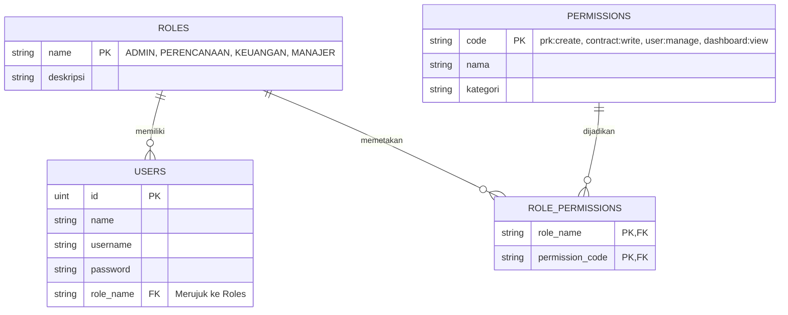

# Roadmap Pengembangan Tahap Selanjutnya: Matriks RBAC Dinamis

Dokumen ini memuat rencana kerja (roadmap) untuk mengembangkan fitur **Pengelolaan Matriks RBAC Dinamis** pada aplikasi **Si Monang** di fase berikutnya, menggantikan sistem otorisasi statis saat ini dengan basis data dinamis.

---

## 1. Arsitektur Matriks RBAC Dinamis

Untuk mendukung pengelolaan hak akses secara real-time dari web UI, struktur data akan diubah dari sistem pengecekan role statis menjadi sistem pemetaan izin (*permission-based access control*):

---

## 2. Fase Pengembangan (Sprint Plan)

Kami membagi pengembangan fitur ini menjadi **3 Fase Utama**:

### 📊 Fase 1: Desain Basis Data & Seeder (Estimasi: 3 Hari)
*   **Target**: Menyiapkan struktur tabel baru dan relasi entitas di GORM.
*   **Tugas**:
    1.  Membuat model `Role`, `Permission`, dan `RolePermission` di `backend/internal/models/models.go`.
    2.  Membuat seeder default di `main.go` untuk mendaftarkan hak akses bawaan (contoh: `prk:create`, `prk:delete`, `contract:write`, `user:manage`, `dashboard:view`).
    3.  Mengaitkan entitas `User` dengan tabel `Role`.

### ⚙️ Fase 2: API Otorisasi Dinamis di Go Backend (Estimasi: 4 Hari)
*   **Target**: Menyediakan endpoint konfigurasi matriks dan middleware berbasis permission.
*   **Tugas**:
    1.  Membuat middleware baru `middleware.PermissionMiddleware(requiredPermission)` untuk menggantikan `RoleMiddleware`. Middleware ini akan memvalidasi apakah user memiliki permission terkait di database.
    2.  Membuat API endpoint untuk manajemen RBAC:
        *   `GET /api/rbac/matrix` -> Mengambil pemetaan matriks (Relasi Role & Permission).
        *   `POST /api/rbac/matrix` -> Menyimpan pembaruan matriks dari UI (tindakan simpan checkbox).
        *   `GET /api/rbac/permissions` -> Mengambil seluruh list hak akses tersedia.

### 💻 Fase 3: Antarmuka Matriks Checkbox di React UI (Estimasi: 5 Hari)
*   **Target**: Membuat halaman manajemen interaktif bagi Super Admin untuk mencentang/menghapus hak akses.
*   **Tugas**:
    1.  Membuat tab menu baru **"Kelola RBAC"** pada panel Admin di sidebar.
    2.  Menyajikan **Matriks Grid Table**:
        *   **Baris**: Daftar Permission (misal: "Membuat PRK baru", "Menghapus Kontrak").
        *   **Kolom**: Daftar Role (Admin, Perencanaan, Keuangan, Manajer).
        *   **Isi Sel**: Checkbox interaktif untuk mengaktifkan/menonaktifkan izin.
    3.  Menghubungkan aksi simpan checkbox ke API `POST /api/rbac/matrix`.
    4.  Refaktorisasi pemeriksaan hak akses di React (menyembunyikan tombol/form berdasarkan daftar permission yang dimiliki user yang sedang login, bukan berdasarkan nama role-nya secara mentah).
